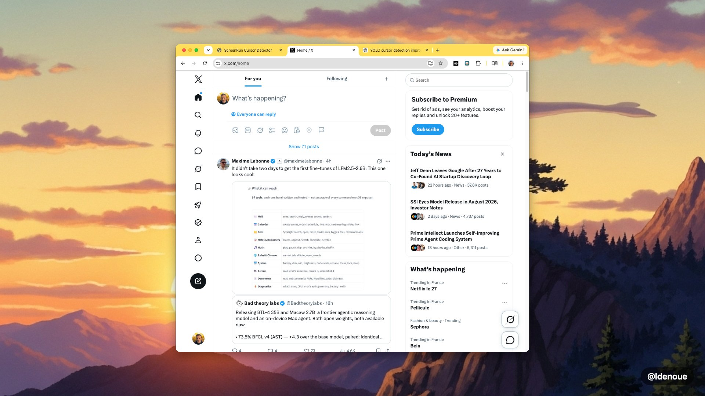
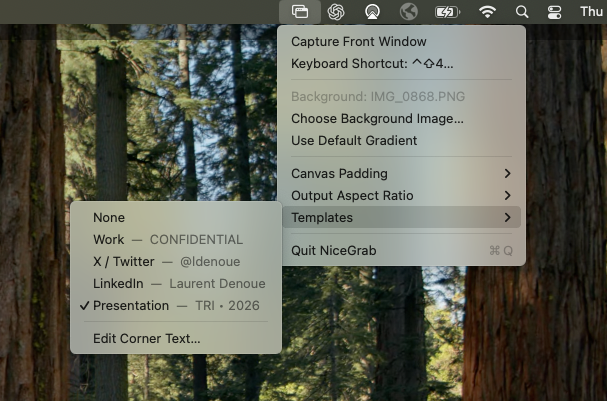

# NiceGrab

NiceGrab is a tiny native macOS menu-bar app for turning ordinary window screenshots into polished, share-ready images.

Press a global keyboard shortcut and NiceGrab captures the frontmost window, centers it on your chosen background, adds optional template text, and puts the finished image directly on the clipboard.



## What it does

- Captures the frontmost macOS window with one global shortcut
- Copies the composed image directly to the clipboard
- Uses any image as the background, or a built-in purple-to-coral gradient
- Produces adaptive, 16:9, 4:3, or square output
- Offers compact, comfortable, and spacious canvas padding
- Includes Work, X/Twitter, LinkedIn, and Presentation templates
- Saves custom corner text separately for every template
- Lets you configure the global keyboard shortcut
- Plays the familiar macOS camera sound after a successful capture
- Lives entirely in the menu bar—there is no Dock icon or main window



## Requirements

- macOS 13 or newer
- Screen Recording permission, used only to capture the selected window
- Xcode 14 or newer when building from source

NiceGrab guides you directly to **System Settings → Privacy & Security → Screen Recording** when permission is missing.

## Build and run with Xcode

1. Clone the repository:

   ```sh
   git clone https://github.com/ldenoue/nicegrab.git
   cd nicegrab
   ```

2. Open `FrameGrab.xcodeproj` in Xcode.
3. Select the **FrameGrab** scheme and your Mac as the run destination.
4. Choose your development team under **Signing & Capabilities** if needed.
5. Press **Run**.

The built product and executable are named **NiceGrab** and use the bundle identifier `com.appblit.nicegrab`.

## Build from Terminal

To create a locally signed app in `dist/NiceGrab.app`:

```sh
./scripts/build-app.sh
open dist/NiceGrab.app
```

The underlying Swift package can also be run directly:

```sh
swift run FrameGrab
```

## Using NiceGrab

1. Launch NiceGrab and find the overlapping-window icon in the menu bar.
2. Choose a background image and output aspect ratio.
3. Optionally select a template and edit its corner text.
4. Bring the window you want to capture to the front.
5. Press the configured shortcut—**Control–Shift–4** by default.
6. Paste the finished image into Messages, Mail, X, Slack, a document, or an image editor.

Preferences such as the background, canvas format, padding, template text, and keyboard shortcut persist between launches.

## Privacy

NiceGrab works locally on your Mac. Screenshots and background images are composited in memory and written to the system clipboard; they are not uploaded anywhere.

## Project structure

- `Sources/FrameGrab` — AppKit menu-bar app and screenshot compositor
- `Resources/Assets.xcassets` — NiceGrab app icon assets
- `FrameGrab.xcodeproj` — Xcode project
- `scripts/build-app.sh` — standalone app-bundle builder
- `scripts/generate-icon.swift` — app-icon source generator
